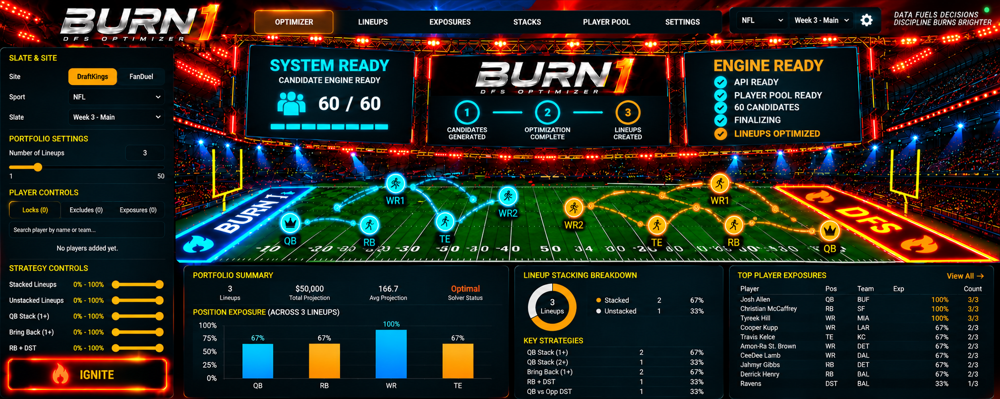

# BURN1 DFS Optimizer

BURN1 is an independently developed full-stack NFL daily fantasy sports lineup optimization application.

The project combines a React/Vite user interface, a FastAPI/Pydantic Python API, Google OR-Tools optimization, validation safeguards, portfolio exposure controls, feature engineering, predictive modeling infrastructure, and an isolated historical backtesting framework.

## Features

- DraftKings and FanDuel NFL lineup support
- Salary-cap and roster-position enforcement
- Multi-lineup portfolio generation
- Google OR-Tools constraint optimization
- Player locks and exclusions
- Minimum lineup uniqueness controls
- Quarterback stacking and bring-back constraints
- RB/DST correlation controls
- Stage 1 candidate-pool exposure controls
- Stage 2 final-portfolio exposure controls
- Pre-lock player-pool validation
- Final-lineup validation
- Background API job execution and progress reporting
- Historical backtesting and lineup scoring infrastructure
- Exposure-matrix experimentation
- NFL feature engineering and model-training workflows
- Deterministic player-identity normalization

## Technology

### Backend

- Python
- FastAPI
- Pydantic
- Google OR-Tools
- pandas
- NumPy
- Polars
- scikit-learn

### Frontend

- React 19
- Vite
- JavaScript
- CSS

### Engineering

- Git
- REST API architecture
- Constraint programming
- Feature engineering
- Predictive modeling
- Historical backtesting
- Validation and testing

## Architecture

The React frontend communicates with a FastAPI backend.

The backend loads a normalized player pool and passes lineup constraints to the BURN1 optimization layer. Google OR-Tools generates candidate lineups subject to salary, roster, stacking, uniqueness, lock, exclusion, and exposure constraints.

A second portfolio-selection stage selects the requested final lineup set while enforcing portfolio-level exposure constraints.

Separate validation logic checks the player pool before optimization and validates final lineups before results are returned.

The `backtest/` package is intentionally separated from the production optimization workflow so historical experiments do not alter production optimizer behavior.

## Project Structure

- `app/` — FastAPI application, API contract, validation, and intelligence utilities
- `optimizer/` — lineup and portfolio optimization logic
- `models/` — application data models
- `sites/` — DraftKings and FanDuel roster configuration
- `features/` — NFL feature engineering
- `modeling/` — model training and evaluation workflows
- `backtest/` — historical replay, scoring, experiments, providers, and validation infrastructure
- `tests/` — feature-parity and related tests
- `frontend/` — React/Vite user interface
- `utils/` — shared utilities including player identity normalization

## Local Setup

Create and activate a Python virtual environment, then install the backend dependencies:

    pip install -r requirements.txt

Install frontend dependencies:

    cd frontend
    npm install

Start the frontend development server:

    npm run dev

The development frontend is configured for:

    http://127.0.0.1:5173/

The FastAPI application entry point is:

    app.api:app

For example, a local development server can be started with:

    uvicorn app.api:app --reload

## Data and Model Artifacts

This public repository intentionally does **not** distribute third-party or provider-derived DFS salary/slate datasets.

Local development and backtesting may use lawfully obtained salary, slate, historical, or licensed provider data. Those datasets are excluded from version control.

Generated lineup results, experimental output datasets, and trained model binary artifacts are also excluded from the public repository.

Historical NFL statistical workflows use the nflverse ecosystem through `nflreadpy`. Users should review and comply with the applicable licenses and attribution requirements of any external datasets they use.

See [NOTICE.md](NOTICE.md) for additional third-party and trademark information.

## Project Status

BURN1 is an independently developed software engineering project and is actively being expanded and tested.

The repository demonstrates full-stack application development, API design, constraint optimization, data engineering, predictive-modeling infrastructure, backtesting, validation, and frontend development.

## Disclaimer

BURN1 is an independent project and is not affiliated with, sponsored by, endorsed by, or operated by DraftKings or FanDuel.

DraftKings, FanDuel, NFL, and other third-party names and trademarks referenced in this project remain the property of their respective owners.

Users are responsible for obtaining data lawfully and complying with applicable laws, licenses, contest rules, and platform terms of service.